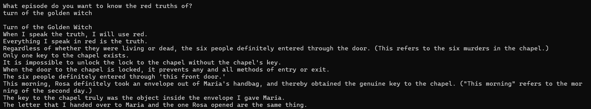
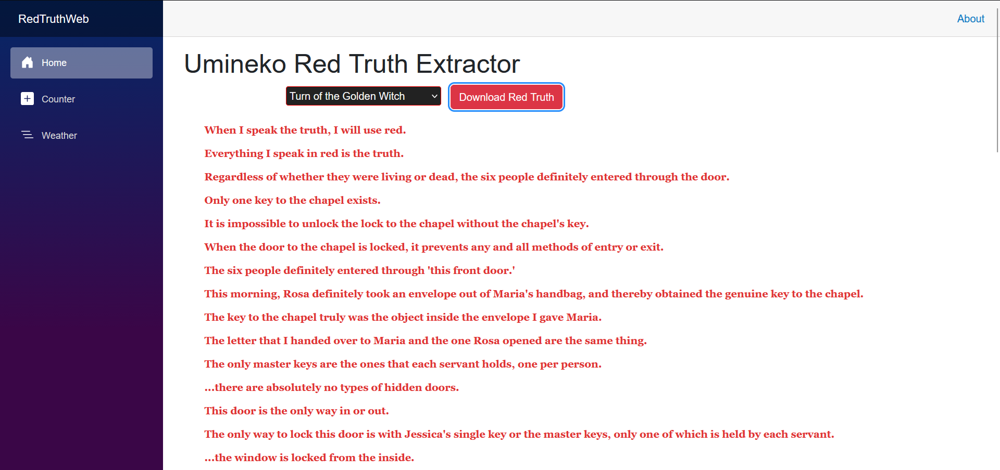

# Red truth extractor

## The red only tells the truth

First exercise with web scraping, coding a way to extract the so called **Red Truths**, a fundamental piece of the narrative of the visual novel _Umineko no naku koro ni_ (Umineko when they cry), from the dedicated [page](https://wiki.whentheycry.org/wiki/Red_Truth) from the When They Cry Wiki.

This tool asks for an episode from the visual novel the user wants to know the red truths of, it makes a request through the MediaWiki API for the list of all sections of the page Red Truth and checks for the section with the corresponing name. If the request is successful, the console prints the list of all red truths.

## Knox's 8th. It is forbidden for the case to be resolved with clues that are not PRESENTED!!

- This project was made in **C#** (**.NET 10**)
- **System.Text.Json** is used to manage API responses
- **HtmlAgilityPack** is used to parse the content received, navigate through it and clean it of all the tags and the links that were not needed

## Versions available

- **Console Version (CLI)**: The original core logic built in C# for terminal usage. It scans the layout sequentially to separate text fragments from the witch's truth.
- **Web Version (Blazor WASM)**: Modern implementation utilizing Blazor WebAssembly. It features:
  - **Dynamic CSS Parsing**: Detects both raw color names and specific RGB/HEX formats dynamically used by the Wiki (`rgb(224, 49, 49)`).
  - **Context-Aware Semantic Splitter**: Uses structural parent/child text nodes to accurately isolate the _Speaker_, any _Context Prefix_ (like `[Those are]`), the _Red Truth_ itself, and any _Trailing Text_ (like `, right?`), rendering each with its appropriate visual novel styling.
  - **Sanitization Pipeline**: Cleans out noise, Wikipedia metadata, and parenthesis comments using optimized Regular Expressions.

## There were no tricks like that!! It was just an ordinary table and an ordinary cup!!

1. Clone the repository:

```bash
    git clone https://github.com/taitorP/Umineko-RedTruth-Extractor
```

To run the console version:

2. Navigate to the project folder:

```bash
    cd Umineko-RedTruth-Extractor
    cd RedTruthWTCWiki.Console
```

3. Start the application:

```bash
    dotnet run
```

4. Enter the name or the number of the episode you want to know the red truths of
5. Read the red truths as they are printed out on the console



To run the web version:

2. Navigate to the project folder:

```bash
    cd Umineko-RedTruth-Extractor
    cd RedTruthWTCWiki.Web
```

3. Start the local development server:

```bash
    dotnet watch
```

4. Select your preferred episode from the drop-down menu and press the red button
5. Read the red truths as they are printed out on the webpage


